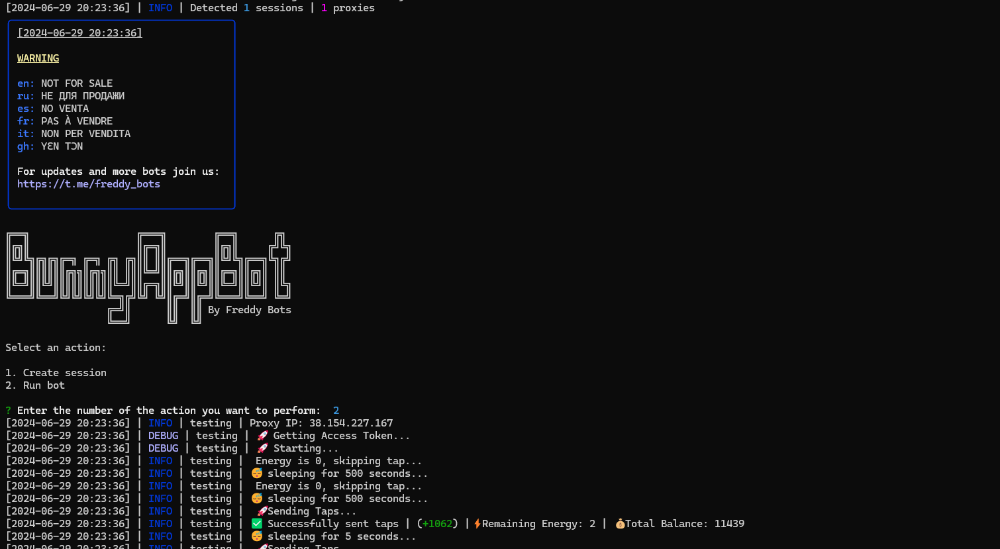

> [](https://t.me/roddyfred)



# Use Node.Js 18 or greater

## Functionality

| Functional                                                  | Supported |
| ----------------------------------------------------------- | :-------: |
| Purchasing of cards                                         |    ✅     |
| Claiming cards reward                                       |    ✅     |
| Claiming Daily Reward                                       |    ✅     |
| Multithreading                                              |    ✅     |
| Binding a proxy to a session                                |    ✅     |
| Auto-purchase of items if you have coins (multitap, energy) |    ✅     |
| Random sleep time between clicks                            |    ✅     |
| Random number of clicks per request                         |    ✅     |

## [Settings](https://github.com/FreddyWhest/BunnyAppBot/blob/main/.env-example)

| Settings                   | Description                                                               |
| -------------------------- | ------------------------------------------------------------------------- |
| **API_ID / API_HASH**      | Platform data from which to launch a Telegram session (stock - Android)   |
| **AUTO_UPGRADE_MULTITAP**  | Whether the bot should upgrade the multitap (True / False)                |
| **MAX_MULTITAP_LEVEL**     | Maximum level of multitap (eg 5)                                          |
| **AUTO_UPGRADE_ENERGY**    | Whether the bot should upgrade the energy (True / False)                  |
| **MAX_ENERGY_LEVEL**       | Maximum level of energy (eg 5)                                            |
| **AUTO_BUY_CARDS**         | Whether the bot should buy or upgrade cards (True / False)                |
| **MAX_LEVEL_CARDS**        | Maximum level of each cards (eg 5)                                        |
| **APPLY_DAILY_ENERGY**     | Whether to use the daily free energy reset (True / False)                 |
| **APPLY_DAILY_TURBO**      | Whether to use the daily free turbo boost (True / False)                  |
| **SLEEP_BETWEEN_TAP**      | Random delay between taps in seconds (eg 10,26)                           |
| **USE_PROXY_FROM_FILE**    | Whether to use proxy from the `bot/config/proxies.js` file (True / False) |
| **RANDOM_TAPS_COUNT**      | Random number of taps (eg [50, 200]). MIN=1, MAX=1200                     |
| **RANDOM_MEGA_TAPS_COUNT** | Random number of taps when boost applied (eg [50, 200]). MIN=1, MAX=10000 |

## Installation

You can download [**Repository**](https://github.com/FreddyWhest/BunnyAppBot) by cloning it to your system and installing the necessary dependencies:

```shell
~ >>> git clone https://github.com/FreddyWhest/BunnyAppBot.git
~ >>> cd BunnyAppBot

#Linux and MocOS
~/BunnyAppBot >>> chmod +x check_node.sh
~/BunnyAppBot >>> ./check_node.sh

OR

~/BunnyAppBot >>> npm install
~/BunnyAppBot >>> cp .env-example .env
~/BunnyAppBot >>> nano .env # Here you must specify your API_ID and API_HASH , the rest is taken by default
~/BunnyAppBot >>> node index.js

#Windows
1. Double click on INSTALL.bat in BunnyAppBot directory to install the dependencies
2. Double click on START.bat in BunnyAppBot directory to start the bot

OR

~/BunnyAppBot >>> npm install
~/BunnyAppBot >>> cp .env-example .env
~/BunnyAppBot >>> # Specify your API_ID and API_HASH, the rest is taken by default
~/BunnyAppBot >>> node index.js
```

Also for quick launch you can use arguments, for example:

```shell
~/BunnyAppBot >>> node index.js --action=1

OR

~/BunnyAppBot >>> node index.js --action=2

#1 - Create session
#2 - Run clicker
```
